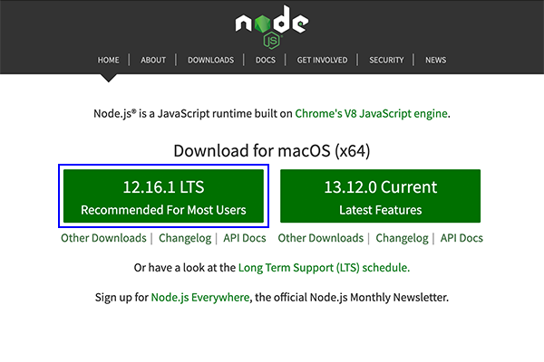

# Node.js Installation Guide (Mac)

* Go to the [Node.js website](https://nodejs.org/en).

* Under "Download for macOS", click the green box with the LTS version of Node to download the installer.

  * The correct version will be labeled "12.x.x LTS Recommended for Most Users", where "x.x" is a combination of numbers.

  * For example, the version shown in the following image is "12.16.1 LTS":

    

* After the installer has downloaded, open it to begin the installation process.

* Follow all of the installation prompts until Node.js is installed on your computer.
