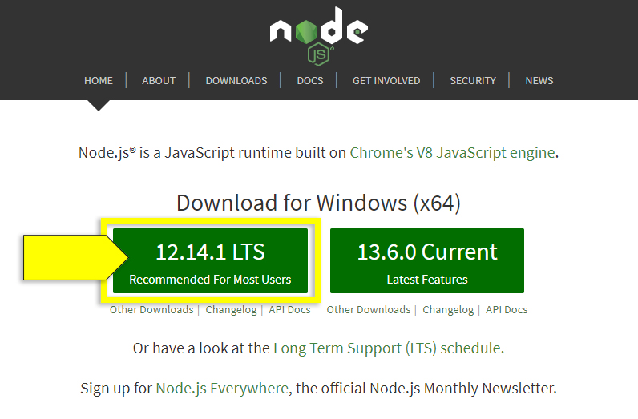
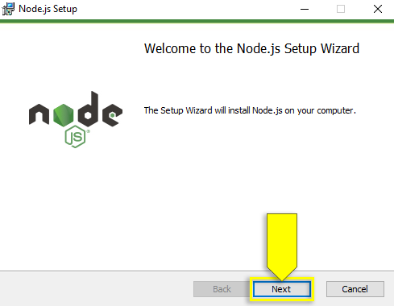
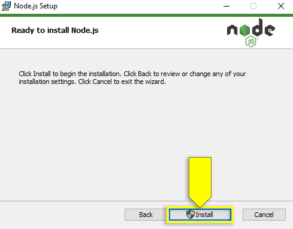

# Node.js Installation Guide (Win)

* Go to the [Node.js website](https://nodejs.org/en).

* Under "Download for Windows", click the green box with the LTS version of Node to download the installer.

  * The correct version will be labeled "12.x.x LTS Recommended for Most Users", where "x.x" is a combination of numbers.

  * For example, the version shown in the following image is "12.14.1 LTS":

    

* After the installer has downloaded, open it to begin the installation process.

* Follow the prompts by clicking Next in the Setup Wizard, as shown in the following image:

  

* After you click the checkbox to accept the license agreement, continue clicking Next until the installation screen says "Ready to install Node.js".

* Click the Install button to finish installing Node.js.

  

* When the installation is complete, click Finish.
